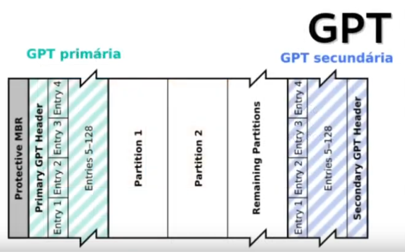
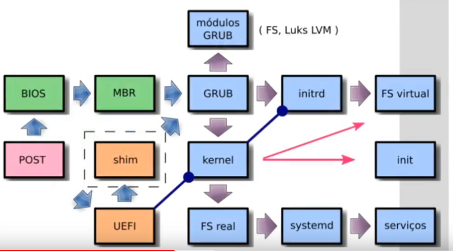

# Modelo mental do boot (BIOS/UEFI)
===================

## BIOS e UEFI

BIOS  80's

UEFI => GPT, DOS, FAT, PE, secure-boot

coreboot, libreboot.

UEFI tem vantagens sobre a BIOS.

UEFI "conhece" os sitemas de particionamentos, sistemas de arquivos FAT, conhece formato de arquivos executáveis (PE, Portable Executable).

Podemos chamar eles de firmwares (BIOS e UEFI), são softwares mas fazem parte da máquina.

----------------------
## Particionamento

É um regime de tabelas de particionamento, em uma determinada área do disco se incluem informações sobre as partições do disco.

### dos/MBR

 => 4 partições, 2Tb (particionamento antigo, usado desde a década de 80).

Essa ideia de 4 partições foi contornada por uma ideia de partição estendida. É uma gambiarra.

MBR = Master boot record

MBR é um bloco, um setor, muita gente chama de setor 0 ou partição 0, composto de 512 bytes. Nos primeiros tem a  tabela de partição. Nos outros tem uma parte do bootloader.

Tem 2 bytes que não aparecem, que são uma assinatura.

446 bytes não é um tamanho bom para termos um programa sofisticado, quando a gente escolhe um dispositivo, a bios procurar ler os 446 bytes, onde tem o programa para dar início ao SO.

### GPT

GUID partition table

GUID = Global Unique Identifiers

128 partições, 9 ZB (1 ZB = 1 bilhão de Tb)

Na verdade o limite de 128 partições é do sistema operacional, e não do sistema de particionamento.

A parte inicial fica em Protective MBR e a tabela de particionamento fica na próxima parte, do Primary GPT Header até Entries 5-128.

Ao final temos uma segunda tabela, que é uma cópia da primeira. Reserva, por conta que se der algum problema, temos ela.

## Bootloader

### grub

O mais utilizado.

Também é composto por estágios e módulos, para por exemplo, carregar sistemas de arquivos, vídeo, criptografia, volumes lógicos.

Quando a gente usa UEFI a gente não precisa desses vários estágios. Porque ela é capaz de entender o sistema de arquivos e pegar o grub como um todo.

grub64.efi

## Kernel

Ele é um arquivo (5 a 15 mb). Costuma chamar /vmlinuz.

O "z" do nome é porque ele é compactado.

Você pode compilar seu próprio kernel. Colocando coisas, tirando outras, etc.

O Kernel também tem uma porção de módulos, nem tudo que está no Kernel está no arquivo dele. Ele tem uma porção de módulos, dá uns 300 mb.

Alguns são colocados dentro do próprio Kernel, módulos "built-in". E outros foram separados.

Muito modular e flexível.

## Initrd

É uma imagem do disco. (8 a 20 mb)

Ele tem uma porção de módulos do Kernel. Que não estão no arquivo do Kernel, mas que sua máquina precisa para conseguir ter acesso ao dispositivo principal, por exemplo o HD.

Quando a gente instala um novo Kernel, um novo Initrd é criado, calculado, com as coisas fundamentais.

## Como funciona

Toda main board possui seus circuitos e também software. Um desses softwares, é o POST (Power On Self Test). Testa várias coisas, placa de vídeos, memória.

O próximo é a BIOS, que também é testada pelo POST anteriormente. Ela vai a procura do MBR, dos 446 bytes que estão no primeiro dispositivo.

O programa que está na MBR tem o objetivo de carregar o bootloader (grub).

Se for uma máquina mais recente, não será BIOS, será UEFI, ela consegue carregar o grub de uma tacada só.

O grub é um programa executável, formato PE (mesmo formato do Windows).

Se foi carregado secure boot, o que for carregado pela UEFI será chegado com as assinaturas que estão no UEFI.

O shin é um pré bootloader (se a UEFI tiver secure boot), ele que efetivamente vai carregar o grub.

Se configurado pra isso (O Debian possui este recurso), a UEFI pode carregar diretamente o Kernel, sem passar pelo grub.

O grub carregado, ele vai procurar por um arquivo de configuração, se encontrado ele vai apresentar um menu pra gente.

O que o grub faz inicialmente é carregar um initrd, e preparar o sistema de arquivos virtual.

O grub também carrega o kernel. Porque o kernel em funcionamento monta em sua estrutura de diretórios o sistema de arquivos virtual.

O sistema de arquivos virtual (FS virtual) tem um script de inicialização chamado *init*, que vai dar conta do kernel carregar alguns módulos para montar o sistema de arquivos real, é aqui onde a gente diz onde tá o barra /.

O primeiro programa q vai rodar é o sistema de inicialização (no caso, systemd), ele vai colocar todos os serviços em funcionamento.

